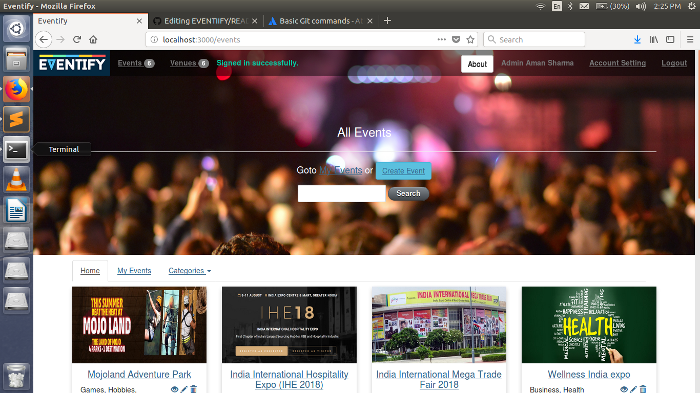

## Eventify
#### [Github](https://github.com/ammu0001/EVENTIIFY.git) |
An event management web application made in Rails 4 from scratch.  
Roles : Event Organiser, Venue Owner and Normal Users.

#### Ruby on Rails Requirement
	*   ruby-1.9.3-p551 [ x86_64 ]
   		ruby-2.0.0-p648 [ x86_64 ]
 	  =*ruby-2.1.10 [ x86_64 ] This Version use to setup this project
   		ruby-2.4.1 [ x86_64 ]
   		ruby-2.5.3 [ x86_64 ]
 		ruby-2.6.1 [ x86_64 ]

# => - current
# =* - current && default
#  * - default
#### Rails Requirement
     *	rails 4.2.6
#### Database gem Used
	 *  gem 'sqlite3', '1.3.6'
#### Setup:
* Clone the repo
* Run bundle install
* Run `rake db:setup:all`
* To generate some dummy data : Run `rake setup_data`
    Optionally, clear the data with `rake clear_data`

#### Dependencies used:
- devise gem : For User Authentication 
- cancancan gem : For Role Management 
- carrierwave gem : For image upload
- cloudinary gem : For hosting images
- faker gem : To generate dummy data
- JQuery Full Calendar : To display booked dates for events/venues
- Momentjs : To format date in javascript
- JQuery Chosen : To enhance select boxes
- DateTime Picker : For choosing date and time
- Project Developed by Aman Sharma